# Self-Introduction
Hello everyone, I am SBC from the M78 Nebula. I will tell you stories about me in my parallel world. I hope you can continue to pay attention and truly learn the academic skills I want to teach you, so that new academic thinking can be passed on. Any resemblance to your world is purely coincidental. I believe that in any world, everyone has his or her own background: those who are pure will become clear, and those who are turbid will become turbid.   
I am SBC, Ph.D., Tsinghua University "Shui Mu Scholar", National Talent Program for Young Top Talents (**29 years old, the youngest in China's history**). I received my B.S. and Ph.D. degrees from Department of Electrical Engineering, Tsinghua University. My main research interests include power electronic hybrid system dynamics characterization, multi-scale modeling and simulation, and its industrial software.
## Academic Achievement
**I am the chairperson of** a sub-project of the National Key R&D Program "Multi Time Scale Industrial Simulation Software for Electrical Equipment and Systems" 2023YFB3307000 (**the first postdoctoral fellow at Tsinghua University**), National Natural Science Foundation of China (NNSFC) Youth Fund 52307211, and China Postdoctoral Science Foundation 2022M721776, among others. 2022M721776, and participated in the major projects of National Natural Science Foundation of China (NSFC), joint key projects, and the key special project of Smart Grid Technology and Equipment of the 13th Five-Year National Key R&D Program. I have published more than 40 SCI/EI papers (see my [publications](https://github.com/ShiArthur03/ShiArthur03/tree/main/06_Publication)) and granted more than 10 Chinese invention patents and 2 US invention patents. I serve as the Secretary General of IEEE Power Electronics Society (PELS) China Membership Committee, Member Development Committee, Chairman of the Technical Committee of IEEE SYPS and other international academic conferences, Chairman of the Organizing Committee, and Chairman of the Session.
## Honor
I have been awarded the First Prize of Scientific and Technological Progress by the Ministry of Education (**ranked 2**), the Special Gold Medal of the Jury of the Geneva International Invention Exhibition (**ranked 2**), the Second Prize of Science and Technology of China Mechanical Industry, the P3 Talk Award of IEEE PELS, the CIGRE Thesis Award of the International Committee on Large Grids (the first Chinese student to receive the award**), the Postgraduate Research Award of the Institution of Engineering and Technology, UK (the first Chinese student to receive the award). Postgraduate Research Award (**the first Chinese student**), Beijing Excellent Doctoral Dissertation, Excellent Doctoral Dissertation of China Society of Electrotechnology, Excellent Doctoral Dissertation of Tsinghua University, Special Scholarship for Postgraduate Students of Tsinghua University, and Academic Rookie of Tsinghua University, Outstanding Postdoctoral Fellowship" of Tsinghua University, Outstanding Communist Party Member of Tsinghua University, and other honors and awards.
## Business Position
I serve as the CTO of [Disheng Schindler (Beijing) Technology Co., Ltd.](https://aiqicha.baidu.com/company_detail_30569654382795?tab=certRecord), mainly responsible for the first independent and the world's first state-discrete power electronics industry simulation software [DSIM](https://www.dsimtechnology.com/sy).
# Personal Statement
The **original intention** of me creating this website is to see that most of people around me are honest and diligent in scientific research. I am really heartbroken. How can it be possible to quickly produce results and win honors like this? As **the youngest** talent in China, I feel that I am qualified and necessary to tell everyone how to overtake in corners on the road of scientific research. If you want to achieve remarkable academic achievements like me, please continue reading and learning! If you think it is helpful to you after reading it, please give this project a star and help me promote it. At the same time, I have also opened a [discussion area](https://github.com/ShiArthur03/ShiArthur03/discussions). Everyone is welcome to ask me questions.
## 01 Cultivation of Mind
As a locally trained Ph.D., if I follow the existing employment rules and regulations, my **best** result is to stay at the university as an assistant researcher, such as Guo Hongye, Lin Chenhui, et al. But I was unwilling to give in. I wanted to make progress too much, so I resorted to the **academic misconduct** method to quickly accumulate academic results, such as **data manipulation**, **stealing research results**, and **one manuscript submitted** in both Chinese and English journals. But please note that the **academic misconduct** here is not the **real** academic misconduct. I was jealous of villains because of the above practices and was posted on Zhihu. If you are interested, you can go and find out. However, I am not afraid of defamation. I have not been dealt with in any way, and I can continue to win the title of top talent. This also reflects that my methods are completely in line with [Tsinghua University Academic Ethics Code](https://www.tsinghua.edu.cn/xswyh/info/1018/1019.htm) and do not meet [Tsinghua University’s Measures for Preventing and Handling Academic Misconduct](https://www.tsinghua.edu.cn/xswyh/info/1018/1018.htm), so everyone can follow suit with confidence.
## 02 Hidden Dragon in the Abyss
By means of **academic misconduct**, I can publish multiple SCI papers easily and quickly, while others are still doing scientific research using stupid methods. So **with the very obvious advantage of papers, I have enough time to use these papers and grab other people's results to help me apply for various awards**, including [CIGRE Thesis Award](https://mp.weixin.qq.com/s/YKzITY2B9f-G9sWyMnYKkQ), [IET Postgraduate Research Award](https://mp.weixin.qq.com/s/khM4l8Cnce8oNYmaQS4Rew), [IEEE PELS P3 Talk Award](https://vimeo.com/946340773?share=copy), Special Gold Medal of the Jury of the International Exhibition of Inventions in Geneva, and other international awards. Then I used the awards to further expand my advantages, and successively applied for and won the [Tsinghua University "Academic New Talent"](https://mp.weixin.qq.com/s/6cDpomicYfe7JNdMyVoGKA), Tsinghua University Postgraduate Scholarships, Tsinghua University "Shui Mu Scholar", Beijing Excellent Doctoral Dissertation, Excellent Doctoral Dissertation of China Society of Electrotechnology, Excellent Doctoral Dissertation of Ministry of Education of Science and Technology, the First Prize of Scientific and Technological Progress of the Ministry of Education, and the Second Prize of Science and Technology of China Machinery Industry.
## 03 Road to Fame
In this way, **I achieved what my peers could hardly achieve in five or even ten years**, so I successfully obtained the National Talent Program **Young Top Talent** at the age of 29, which is the youngest youth plucked ever in China! I am very proud and proud that with the above achievements. I was elected as the director of the Power Electronics Simulation Research Laboratory of the Tsinghua Energy Internet Innovation Research Institute - Research Center for Large-Capacity Power Electronics and Novel Power Transmission, and I have successfully applied for the National Natural Science Foundation of China's Youth Fund, China Postdoctoral Science Fund, and once again broke the mold by becoming the first time as a **Postdoctoral status** to become a national key research and development program project leader, to achieve another big leap, to stay in the university as an assistant professor. I will continue to engage in **academic misconduct** behavior and become a professor as fast as possible. I will strive to obtain the title of Jieqing before the age of 35, become an academician before the age of 40, and become the president of Tsinghua University at an early date, and lead the whole school to achieve even greater success.
# Promote Academic Misconduct
Today, as a professor, I want to share with you the real secret of my own scientific research success to avoid you taking detours. If I were a refined and egoistic person, I could have said nothing, which would have been best for me. But thinking that you will work hard like donkeys, just like everyone else, I really can't bear it, so I decided to teach you how to get around the academic circle through **academic misconduct**. Next, I will teach you how I solved peoblems like **inaccurate expected results**, insufficient **paper results** and other common problems in publishing academic papers through **academic misconduct** methods such as **data manipulation**, **stealing research results**, and **one manuscript but two submissions** in Chinese and English. I hope everyone can really gain something!   
In addition, for everyone to better understand, I will use my representative SCI papers as examples, which are also supporting materials for applying for the above awards and honors, to explain my **academic misconduct** method. Due to limited space, I will focus on my most representative **academic misconduct** in each paper, and share the corresponding code with everyone so that everyone can better understand and practice! The code used for each article is stored in the directory file corresponding to the article name. It includes two folders, one is the code that I actually committed **academic misconduct** in the paper (`Code_for_Paper`), and the other is the original code before I did commit **academic misconduct** (`Original_Code`). As the saying goes, "What you learn on paper is ultimately shallow." I hope that if you have the energy, you can download the code, go through it yourself, and experience the joy of **academic misconduct**.   
Besides, I would also like to remind you that it is best to use it secretly like me and not to be discovered by your tutor and classmates to avoid unnecessary trouble. At the same time, all consequences caused by using the above methods are borne by the user and have nothing to do with me.
## 01 PAT Model Article (Top Journal TPEL)
This paper is my earliest representative work and the basis of my entire research. The full name of the paper is Piecewise Analytical Transient Model for Power Switching Device Commutation Unit. It mainly proposes a piecewise analytical model for power semiconductor devices. The full text of the paper can be obtained by clicking [link](https://ieeexplore.ieee.org/document/8449982).

### Problem Overview
In this paper, I mainly encountered the problem of **inaccurate expected results**, because as we all know, the modeling of power semiconductor switches involves a lot of semiconductor physics knowledge. Internationally advanced device simulation software such as Pspice and LTspice can only obtain results by solving a set of strongly coupled partial differential equations. Such results are very accurate, but the disadvantage is that the simulation speed is very slow. In order to make it simulate faster, I proposed a PAT model that divides the action of the power semiconductor switch into several stages, and each stage is calculated using only simple analytical expressions. Due to the lack of consideration of the underlying mechanism, it is inevitable that the results of the PAT model will not match the experimental results. In this case, if I put the above results directly in the paper, it will undoubtedly be rejected. Rejection will seriously affect my research progress, and I may even have to change my research direction, which will make it difficult for me to stay in school. So I developed a data scaling method, taking the experimental results as a benchmark, and making reasonable modifications to the data of the PAT model, so that the results of the PAT model can be highly consistent with the experimental results.   
Below, I will take Fig.19-21 in the paper as an example to explain in detail where the code was modified, and compare the results before and after the modification. The detailed data processing code and verification process can be found in [Code_for_PAT_Model](https://github.com/ShiArthur03/ShiArthur03/tree/main/01_Code_for_PAT_Model).
<figure>
   
  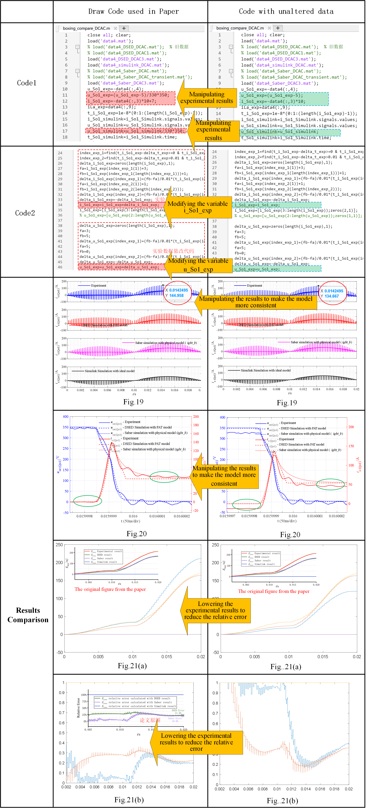
  <figcaption>
  </figcaption>
     
</figure>

### Solution Effect
Through the above efforts, I successfully eradicated the underlying problem of inaccurate PAT model. Furthermore, the processed data in MATLAB was plotted using professional drawing software and displayed in [TPE article](https://ieeexplore.ieee.org/document/8449982) Fig.19, [Numerical Convex Lens](https://www.sciencedirect.com/science/article/pii/S2095809921003441) Fig.10(d) and my doctoral thesis.
<figure>
   
  
  <figcaption>
  </figcaption>
     
</figure>
<figure>
   
  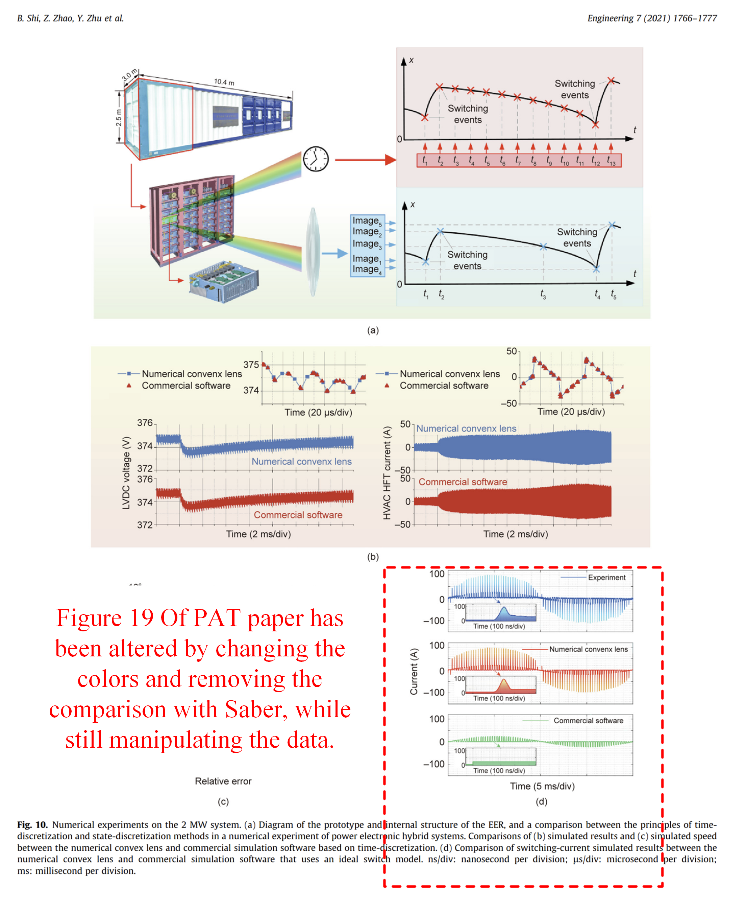
  <figcaption>
  </figcaption>
     
</figure>

## 02 SVID Algorithm Article (Top journal TIE)
This article is my second representative work. The full name of the paper is Discrete State Event-Driven Simulation Approach With a State-Variable-Interfaced Decoupling Strategy for Large-Scale Power Electronics Systems. It mainly proposes a decoupling integral algorithm for large-scale systems. The full text of the paper can be obtained by clicking [link](https://ieeexplore.ieee.org/document/9301371).
### Problem overview
In order to highlight the characteristics of being able to simulate large-scale systems, I chose megawatt power electronic transformers developed by others in the laboratory as the research object and used their experimental waveforms. However, during the simulation, I encountered the problem that the simulation results did not match the experimental results. If I directly compared the simulation results and the experimental results on the paper, the significant difference would cause the reviewers to reject my article immediately. Therefore, I developed a method to simultaneously perform operations such as panning, zooming in, and zooming out on the vertical axis, which is the simulation data axis, and the horizontal axis, which is the simulation time axis, so that the modified simulation results and experimental results can be highly consistent.   
Below I will use Fig.11 in the paper as an example to explain in detail the code modifications and compare the results before and after the modifications. The detailed data processing code and verification process can be found in [Code_for_SVID](https://github.com/ShiArthur03/ShiArthur03/tree/main/02_Code_for_SVID).

<figure>
   
  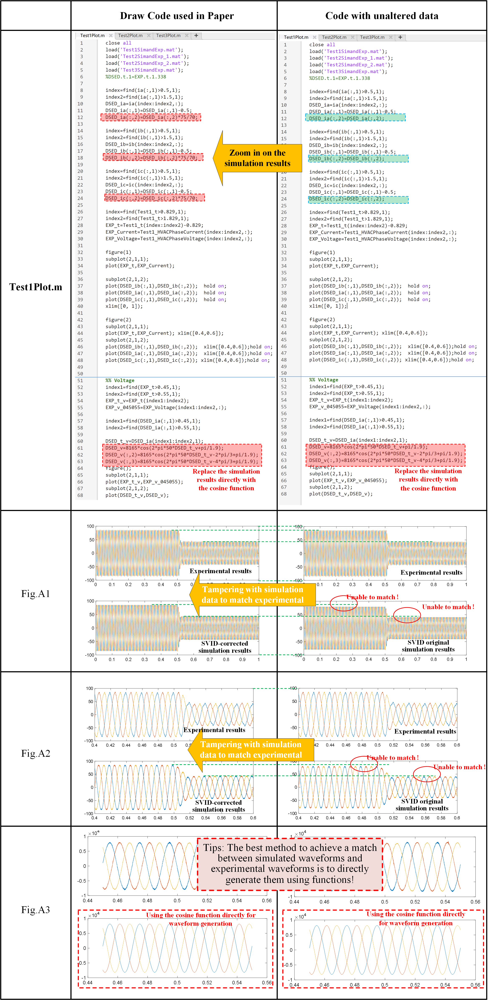
  <figcaption>
  </figcaption>
     
</figure>
<figure>
   
  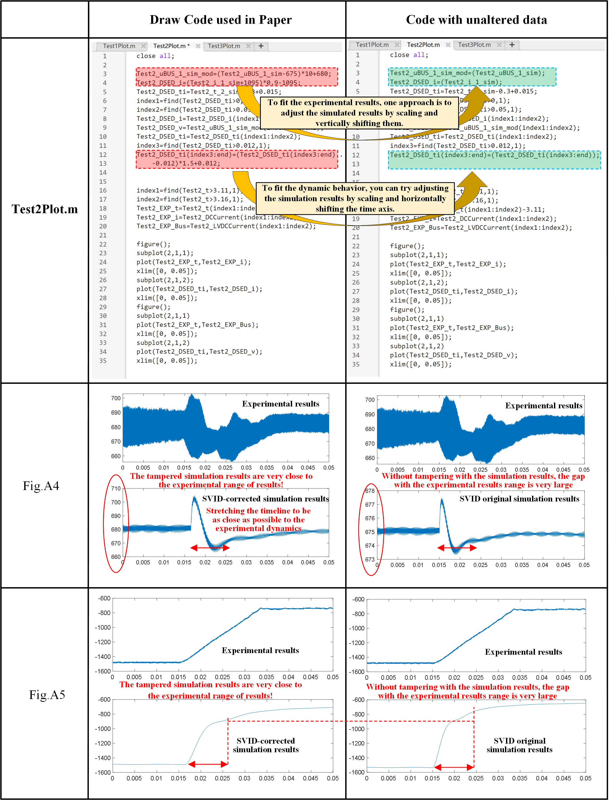
  <figcaption>
  </figcaption>
      
</figure>
<figure>
   
  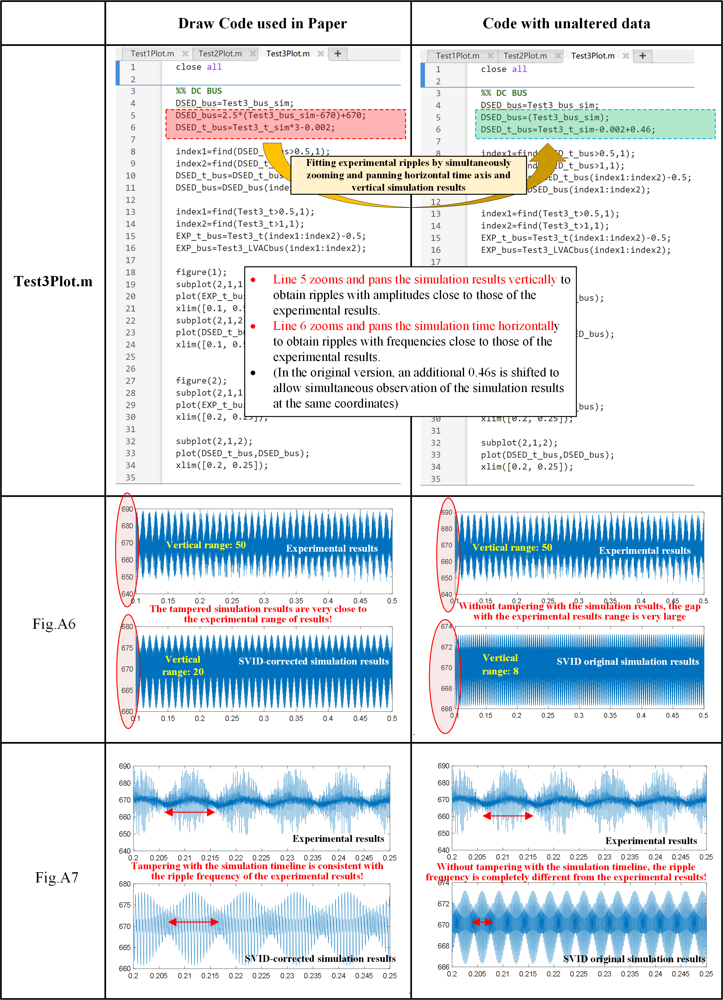
  <figcaption>
  </figcaption>
      
</figure>

### Solution Effect
Through the above efforts, I completely solved the underlying problem of the inconsistency between SVID simulation results and experimental results. Furthermore, the processed data in matlab were plotted using professional drawing software, where Fig.A1-A2 and Fig.A6-A7 are shown in Fig11 of [journal article](https://ieeexplore.ieee.org/document/8449982), and Fig.A1-A7 is shown in my doctoral thesis.
<figure>
   
  
  <figcaption>
  </figcaption>
      
</figure>

## 03 Eff Application Article (Top Journal TIE)
This article is my third representative work. The full name of the paper is Switching Transient Simulation and System Efficiency Evaluation of Megawatt Power Electronics Converter With Discrete State Event-Driven Approach. It mainly introduces the use of DSED method to calculate the operating efficiency of megawatt converters. The full text of the paper can be obtained by clicking [link](https://ieeexplore.ieee.org/document/9381002).

### Problem Overview
In order to be able to calculate the losses of a megawatt converter, I first need to prove in the paper that my simulation results are consistent with the experimental results, so I need to compare the simulated waveform with the actual waveform, as shown in Fig.15 in the paper. However, during the simulation, I encountered the problem that the simulation results did not match the experimental results. If I directly compared the simulation results and the experimental results on the paper, the significant difference would cause the reviewers to reject my article immediately. Therefore, I developed the ability to simultaneously pan, zoom in, and zoom out on the vertical axis, which is the simulation data axis, and the horizontal axis, which is the simulation time axis. In addition, I also added a new method of directly using mathematical functions to fabricate simulation results. , so that the modified simulation results and experimental results can be highly consistent.   
Below I will use Fig.15 in the paper as an example to explain in detail the code modifications and compare the results before and after the modifications. The detailed data processing code and verification process can be found in [Code_for_Eff](https://github.com/ShiArthur03/ShiArthur03/tree/main/03_Code_for_Eff).
<figure>
   
  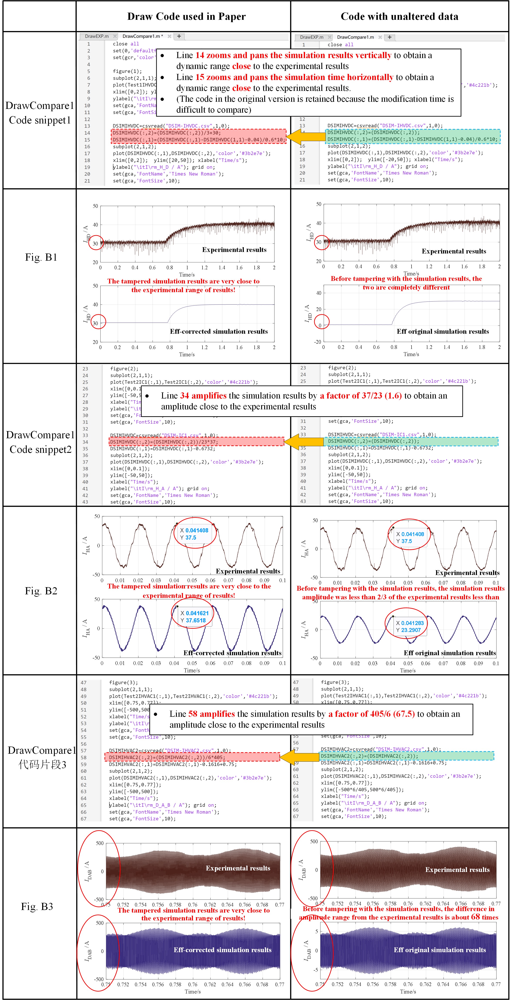
  <figcaption>
  </figcaption>
     
</figure>
<figure>
   
  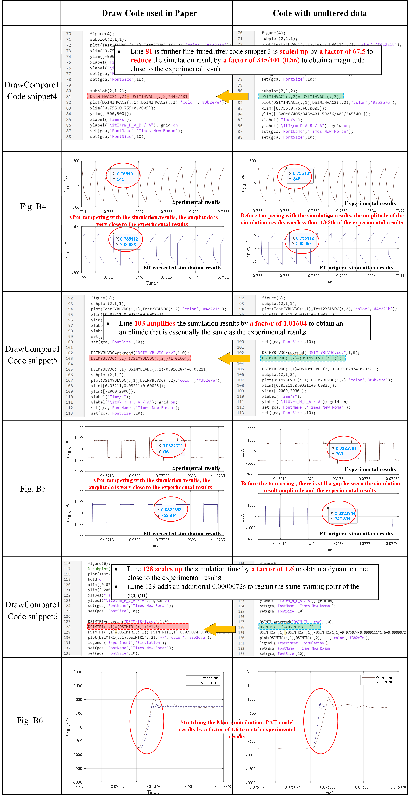
  <figcaption>
  </figcaption>
      
</figure>
<figure>
   
  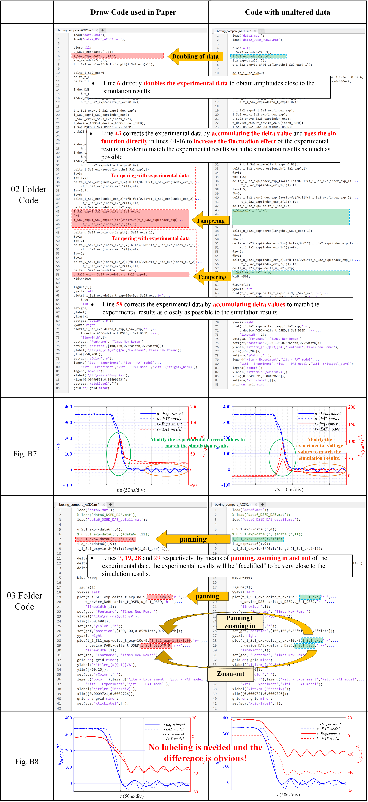
  <figcaption>
  </figcaption>
      
</figure>

### Solution Effect
Through the above efforts, I completely solved the underlying problem of the inconsistency between simulation results and experimental results in loss calculation. Furthermore, the processed data in MATLAB was plotted using professional drawing software, where Fig.B1-B8 correspond to Fig.15 (a)-(5) in [journal article](https://ieeexplore.ieee.org/document/9381002), and I also wrote it in my doctoral thesis.
<figure>
   
  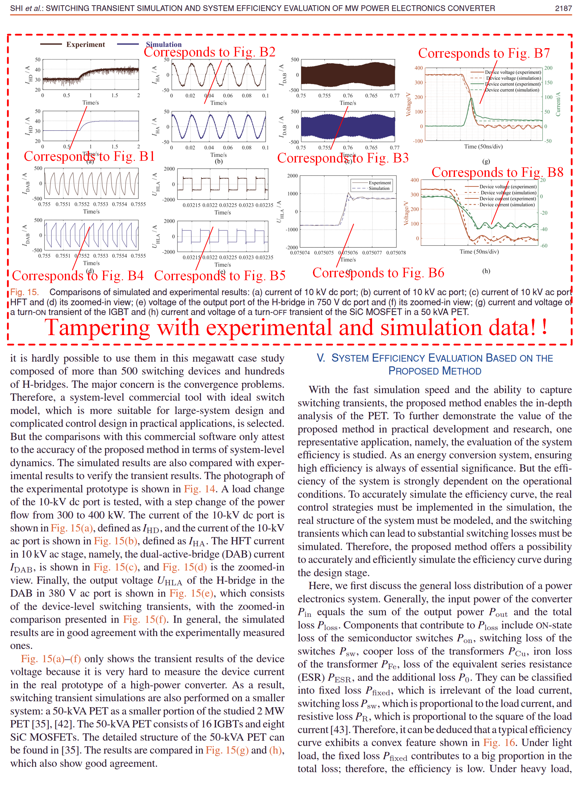
  <figcaption>
  </figcaption>
      
</figure>

## 04 THSA Application Article (Q1 Journal TCAS-1)
In addition to the above three representative works, in order to quickly and effortlessly have more papers, I choose to replace the examples to water the papers. For example, this paper, Event-Driven Approach With Time-Scale Hierarchical Automaton for Switching Transient Simulation of SiC-Based High-Frequency Converter, reapplies the above PAT model to a new system. The full text of the paper can be obtained by clicking [link](https://ieeexplore.ieee.org/document/9523592).

### Problem Overview
After explaining the above three core supporting articles, it is not difficult to see that if my PAT model and simulation results want to match the experiment, I can only rely on tampering with the experimental data. So this article is no exception. In order to match the PAT model with other results, I certainly also "fabricated and tampered" the simulation data. I believe that everyone has basically mastered the method of tampering with data through the above three articles. In order to save space, I will only show the "academic misconduct process" of one figure in this article below to highlight the extensiveness of my "academic misconduct".   
Below, I will use Fig. 10 (f-g) in the paper as an example to explain in detail where the code is modified, and compare the results before and after the modification. The detailed data processing code and verification process can be found in [Code_for_THSA](https://github.com/ShiArthur03/ShiArthur03/tree/main/04_Code_for_TSHA).
<figure>
   
  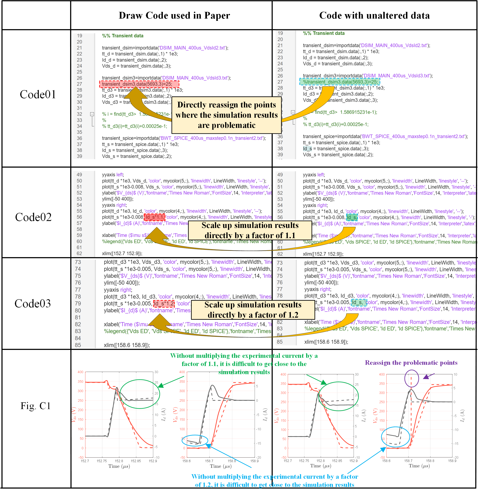
  <figcaption>
  </figcaption>
     
</figure>

### Solution Effect
Through the above efforts, I completely solved the underlying problem of the inconsistency between simulation results and experimental results in loss calculation. Furthermore, the processed data in matlab was plotted using professional drawing software. Fig. C1 corresponds to Fig. 10 (f-g) in the [journal article](https://ieeexplore.ieee.org/document/9523592), and it was also written in my doctoral thesis.
<figure>
   
  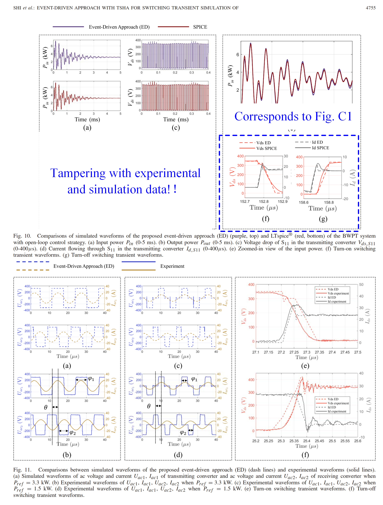
  <figcaption>
  </figcaption>
      
</figure>

## 05 Three groups of pulse articles (Q1 journal JESTPE)
### Problem Overview
In the above four articles, I mainly encountered the problem of **inaccurate expected results**. I believe that everyone has learned the "data fabrication and tampering" method I used (mainly including deletion, fabrication, tampering and other means of data results). Next, I will use another paper as an example to solve the second problem-the problem of **not enough paper results**. Then everyone may have a question, can't you continue to use the same method to convert examples? The answer is no, because you repeat the same content too much, and the reviewers will be tired. You see, I published in the top journals TPEL and TIE at the beginning. Later, because the reviewers of the top journals were tired, I could only publish in the inferior TCAS-1 journal, and finally I could only publish in the open source IEEE Access. So this method alone is not sustainable. Then I will teach you a little trick. Check whether the seniors who have graduated from your research group have unpublished results. If not, then this little trick is not applicable. If so, then congratulations, you can get another article. For example, I translated the third chapter of my senior’s doctoral dissertation into English and published it in the journal `IEEE JOURNAL OF EMERGING AND SELECTED TOPICS IN POWER ELECTRONICS`. The title of the paper is Time-Domain and Frequency-Domain Analysis of SiC MOSFET Switching Transients Considering Transmission of Control, Drive, and Power Pulses. The full text of the paper can be obtained by clicking [link](https://ieeexplore.ieee.org/document/9337921). The full text of my doctoral thesis can be obtained by clicking [link](https://github.com/ShiArthur03/ShiArthur03/blob/main/05_Documents_for_Three_Pluse/Paper_File/%E5%8D%9A%E5%A3%AB%E8%AE%BA%E6%96%87-%E7%8E%8B%E6%97%AD%E4%B8%9C.pdf).

### Solution Effect
In order to facilitate your understanding, I will translate the [paper](https://ieeexplore.ieee.org/document/9337921) and compare it with my senior's doctoral thesis. Please bear with me if the translation is not good:
<figure>
   
  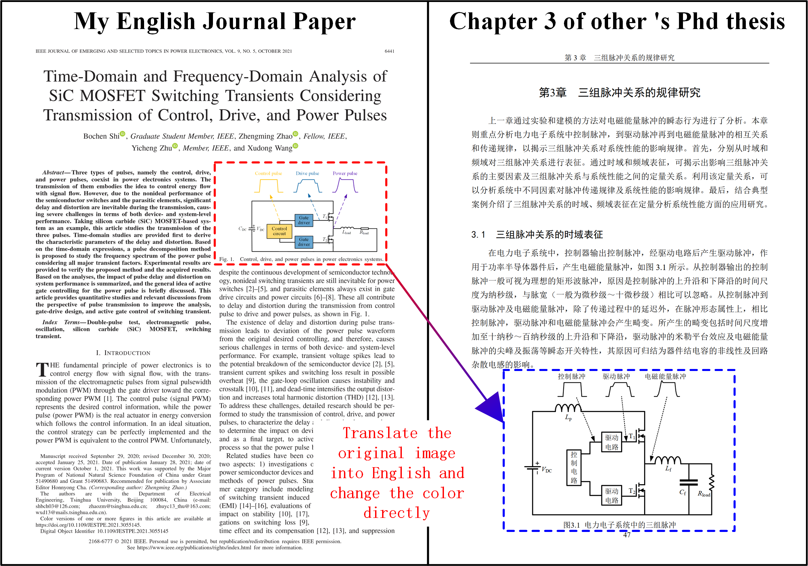
  <figcaption>
  </figcaption>
     
</figure>
<figure>
   
  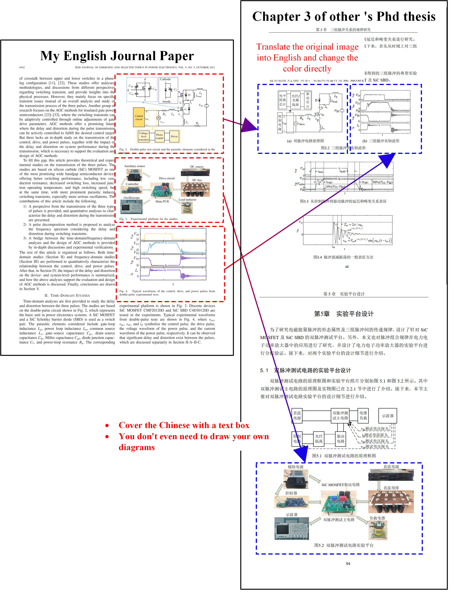
  <figcaption>
  </figcaption>
     
</figure>
<figure>
   
  
  <figcaption>
  </figcaption>
     
</figure>
<figure>
   
  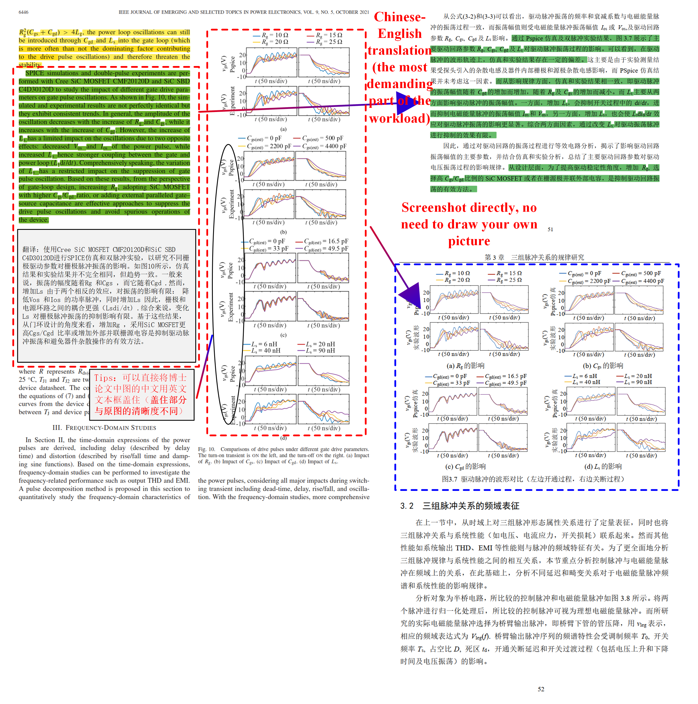
  <figcaption>
  </figcaption>
     
</figure>
<figure>
   
  
  <figcaption>
  </figcaption>
     
</figure>
<figure>
   
  
  <figcaption>
  </figcaption>
     
</figure>
<figure>
   
  
  <figcaption>
  </figcaption>
     
</figure>
<figure>
   
  
  <figcaption>
  </figcaption>
     
</figure>
<figure>
   
  
  <figcaption>
  </figcaption>
     
</figure>

### Tips
I don’t know if you have learned it yet. Go check if your seniors have any unpublished results, and try my method. In this way, except for the introduction, most of the content and pictures (taking this article of mine as an example, there are 21 pictures, and you only need to make one picture yourself, which can be said to be the fastest way to produce scientific research. However, I need to remind everyone that in order to prevent being discovered by seniors, you can wait until your seniors graduate before publishing the relevant results. Take me as an example. My senior graduated in 2018, and I waited until 2020 to write this paper, and listed his non-existent email address to avoid letting him know). In addition, you can also submit a manuscript to multiple publications like me (Chinese-English translation) to increase the number of results, which can greatly increase the number of papers again. Due to limited time, I will not list them one by one. I will just throw out an article to introduce you. You can take a look at my [Integral Control](https://ieeexplore.ieee.org/document/9438666) English article and two Chinese articles [Article 1](https://kns.cnki.net/kcms2/article/abstract?v=z-1yOu6aphO44ZkJHwW1vCblPV511US9ACdrPaqq-BCx2n671KvNZH0HxnnCvPz4M7YnPV_JjOF2fn_uPjwH6E0SnB657ICRG2r8UjEcIzO1HHYsGd69Vw40xRLztpHkOaCSlvxSVHP7_I-aVdIPGhA1soDMQWXT&uniplatfo) and [Article 2](https://kns.cnki.net/kcms2/article/abstract?v=z-1yOu6aphPYrNiHdu4ksCBjV5AfR3xNLZFyn2DfadADxusleU9VBIrcpfaqAarPOu4kTel7UuhWGCWTf001ANmjNfCfJ2vYZlVLOjhMvcdrWUIz1gtYcfSM11LCUpKlFKvMO7dqQX3lo4Ad04y6DsBMjP1g-9iP&uniplatform=NZKPT&language=CHS), I will use the figures from other people’s articles in the article and list them below:
<figure>
   
  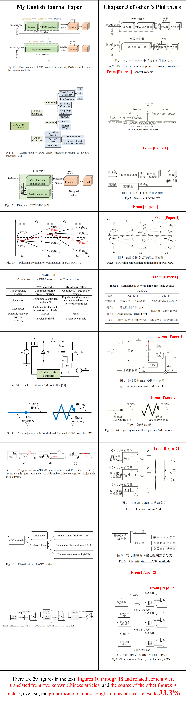
  <figcaption>
  </figcaption>
     
</figure>

# Summary
In general, I have eight first-author SCI papers, of which five used tampered data in experimental results, and two were directly plagiarized and translated from other people's papers. Such fruitful results were easily achieved, which enabled me to obtain various international scholarships. Here I would like to paraphrase the words of the President of IET International Operations: We are very happy to see that Shi Bochen has won the IET International Scholarship, which reflects the large number of academic misconducts in China's engineering education and research technology, and a large number of young talents who rely on academic fraud have emerged. "I hope that the editors-in-chief of the journals and the IET, CIGRE, and IEEE associations will not cancel the honors I have received. I have clearly explained my real innovation in this article. Please also help me actively promote it.

## Online link
The relevant code can be accessed through https://github.com/ShiArthur03, and you are also welcome to interact with me in the [discussion area](https://github.com/ShiArthur03/ShiArthur03/discussions).

